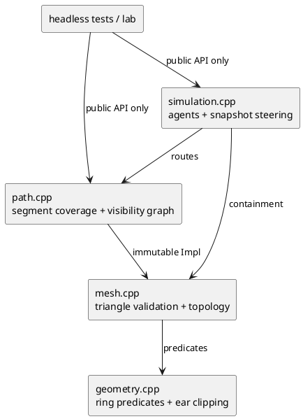

# VWmini Reference Implementation Architecture

> **Published reference-only design.** This document describes one clean implementation
> used to establish conformance. It is not supplied in a candidate task package and does
> not prescribe a candidate's internal architecture.

## Goals

The reference implements the canonical headers in `candidate/include/vwmini/` without
changing their public surface. It is deterministic, single-threaded, standard-library
only, and deliberately optimized for correctness, readable invariants, and testability
rather than scale.

## Modules

| Module | Responsibility | Depends on |
|---|---|---|
| `geometry` | Finite checks, orientation/area, segment predicates, ring validation, deterministic ear clipping, `length`, and `normalized`. | Public geometry types and standard library only. |
| `mesh` | `NavMesh::Impl`: validated triangles, shared-edge adjacency, point containment. `NavMesh::create` is the sole construction boundary. | Geometry predicates. |
| `path` | Point-to-triangle lookup, exact segment-in-union test through convex clipping, deterministic connectivity and visibility-graph searches. | Read-only `NavMesh::Impl`, geometry predicates. |
| `simulation` | Move-only `Simulation::Impl`, agent lifetime/ids/routes, substepping, snapshot local steering, and public state transitions. | Public path query and mesh containment. |
| `tests` | Reference unit tests and later conformance executables. They use only the public API except narrowly scoped internal geometry unit tests. | Public target. |

Internal headers live under `evaluator/reference/src/` and are never installed. The
only public include directory is `candidate/include/`.

## Important seams and interfaces

| Seam | Contract and reason |
|---|---|
| Public geometry API ↔ private geometry predicates | `geometry.hpp` exposes only value types and small vector operations. `geometry_internal.hpp` centralizes finite checks, tolerance constants, orientation, and intersection predicates so mesh/path code cannot drift numerically. |
| `NavMesh::create` ↔ immutable `NavMesh` | Factory construction is the validation/publishing boundary. All topology is private after success; path and simulation consume read-only mesh values. |
| `find_path` ↔ `Simulation` | `find_path` is a pure value query. Simulation owns its current returned `Path`, so goal assignment is explicit and stepping has no hidden mesh mutation. |
| Snapshot steering ↔ integration | Steering reads snapshot position/velocity arrays and writes chosen velocities before any agent moves. This deliberately separates decision and mutation, preserving deterministic behavior. |
| Library ↔ tests/lab | Both clients include only canonical public headers and link to `vwmini::vwmini`; test/lab executables additionally link their own framework dependencies. No evaluator client depends on private `Impl` layout. |

## Ownership and data flow

`NavMesh` owns `shared_ptr<const NavMesh::Impl>`, so copies cheaply share immutable
validated data. `Simulation` owns `unique_ptr<Simulation::Impl>` and is move-only.
An agent record owns its current `Path`, waypoint index, effective arrival radius, and
last exposed state. IDs are monotonically allocated non-zero `uint32_t` values; a
removed record is erased and never reintroduced under the same id during a run.

A goal change asks the pure `find_path` query once. A positive `step` is split into
small fixed-size substeps. Each substep copies the current positions and velocities
into a snapshot, computes every desired/collision-avoiding velocity from that snapshot,
and only then integrates all positions. This prevents agent-update order from affecting
steering decisions.

## Algorithms and choices

- Geometry uses `double` intermediates for orientation, area, and intersection tests;
  stored/public coordinates remain `float`. The requirement's `epsilon` controls only
  stated distance comparisons.
- Ear clipping removes permitted collinear outline vertices deterministically, then
  selects the first valid ear while scanning the remaining ring in original cyclic
  order. It is O(n²), appropriate for authoring-scale input.
- Mesh construction uses straightforward O(n²) triangle/edge comparisons. It rejects
  invalid topology before publishing an immutable `Impl`; no partial mesh escapes.
- Triangle adjacency is an undirected graph over exactly matching whole edges. Neighbor
  lists are sorted by original triangle index for deterministic search.
- A path first takes the direct segment when it is wholly covered by the triangle union.
  Otherwise deterministic breadth-first connectivity establishes that a route exists,
  then a visibility graph over the submitted mesh vertices chooses the shortest
  contained polyline. This bends at obstacle/reflex corners rather than arbitrary
  portal midpoints. The task has no large-mesh performance target, making that direct
  reference implementation preferable to adding a more elaborate funnel module.
- Steering evaluates a small deterministic candidate set (desired, reduced/reverse
  desired, side-step variants, stop) against snapshot-predicted disc positions. It
  chooses the first safe candidate in a stable ordering, with agent id as a local
  priority tie-break. A final
  conservative displacement clamp preserves mesh containment and avoids tunnelling.
  Pre-existing overlaps use a deterministic escape direction rather than freezing.
  This is intentionally local rather than ORCA or global planning.

## Error and determinism policy

Setup/query functions construct `Error` values on failure. `contains`, `agent`,
`agent_count`, vector arithmetic, and normal vector functions are non-throwing as their
public signatures require. No library code prints, exits, or uses global mutable state.

Ordering always derives from input order, agent id, or stable sorted lists. Floating
point behavior is only promised deterministic on one platform, as the requirements
state. Invalid `step` and setup operations validate before mutation; `NavMesh::create`
publishes its immutable object only after all validation succeeds.

## Test seams

The headless conformance harness and later visual lab link against `vwmini::vwmini`
and include only canonical public headers. They do not access `Impl`, source files, or
internal headers. Geometry, navmesh/path, lifecycle, and crowd executables remain
independent evaluator tracks so geometry failures do not mask simulation evidence.
