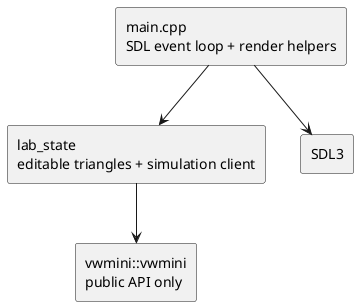

# Visual Lab Architecture

> **Private evaluator tool.** The visual lab is a diagnostic integration client, not a
> library feature and not part of candidate evaluation.

## Decision

Use an optional **SDL3 2D-renderer** application with direct mouse and keyboard
controls. SDL3 is available in the development environment and
provides a window, input, timing, and hardware/software 2D drawing without adding an
OpenGL, Magnum, or ImGui dependency to the evaluator's core build.

Magnum + ImGui remains a good future upgrade if the lab becomes a richer authoring
application. For this diagnostic tool it would add package/build surface and UI
integration code without improving the essential checks: mesh validity, routes,
positions, goals, velocities, and local avoidance.

## Modules

- **`LabState`** owns editable literal triangles, a move-only `Simulation`, and
  UI-side agent/goal metadata. It calls only public `vwmini` APIs. Rebuilding the mesh
  displays any validation error; a failed edit is reverted, while a successful rebuild
  resets the simulation rather than bypassing library validation.
- **`main.cpp`** owns SDL input, camera transforms, and immediate drawing helpers. It
  does not contain mesh validation or simulation logic. It draws editable triangle
  edges/vertices, selected agents, spawn/goal markers, velocity vectors, status colour,
  and concise diagnostics in the window title.

## Interaction contract

- Left-click an empty point: choose spawn position.
- Right-click: choose target; press `A` to create an agent at the spawn with that target.
- Left-click an existing agent: select it. Right-click then `G`: replace its goal.
- Drag a mesh vertex: edit geometry. Release rebuilds the mesh and reports success or
  validation error. Existing agents are reset on a successful rebuild.
- `Space`: pause/run. `N`: one 1/60-second step. `R`: reset the default L-shaped mesh.
- Mouse wheel: zoom; middle drag: pan; `Delete`: remove selected agent.

## Build boundary

`VWMINI_BUILD_LAB` defaults to `OFF` in `evaluator/CMakeLists.txt`. Enabling it runs
`find_package(SDL3 CONFIG REQUIRED)` and builds `vwmini_lab`, linked to the reference
`vwmini::vwmini` target. SDL3 is private to the lab; reference library, headless
conformance harness, candidate package, and public headers remain standard-library
only.
