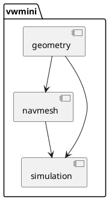

# VWmini Architecture

## Overview
VWmini is a single-threaded C++23 library for immutable 2D navigation meshes, deterministic point-to-point paths, and local disc avoidance. Public API is fixed in `include/vwmini/`. Implementation lives in `src/`.

## Components

### geometry
* `Vec2`, arithmetic, `length`, `normalized`
* `triangulate_simple_polygon` – validation + ear clipping
* Responsibilities: numeric policy, polygon validation, deterministic triangulation.
* No dependencies.

### navmesh
* `NavMesh` immutable value type, factory `create`
* `contains(Vec2)` with epsilon boundary policy
* `find_path` – triangle adjacency, deterministic triangle search, segment containment test, string-pulling shortcutting
* Internal `Impl` holds triangles, adjacency, vertex dedup map.
* Depends on `geometry`.

### simulation
* `Simulation` move-only, owns `NavMesh` value and agent table
* Agent lifecycle: `add_agent`, `remove_agent`, `set_goal`, `clear_goal`, `step`
* Path following along polyline with max speed, waypoint arrival, `Reached`/`Idle`/`Moving`/`NoPath`
* Local avoidance with snapshot semantics and substepping
* Depends on `navmesh` and `geometry`.

## Dependency / Data Flow

```
Polygon → triangulate_simple_polygon → vector<Polygon> → NavMesh::create
NavMesh → contains / find_path
NavMesh + AgentConfig → Simulation
Simulation → step → positions/velocities updated, avoidance snapshot
```

Ownership flows inward: `Simulation` owns `NavMesh` by value, agents own routes derived from mesh. No global state.

## Seams & Interfaces
* `NavMesh::contains` – allocation-free const query.
* `find_path` – pure function on immutable mesh.
* `Simulation::step` – transactional validation, snapshot avoidance.
* All public errors via `Result<T>` / `ErrorCode`.

## Decisions / Trade-offs
* **Ear clipping** for triangulation: simple, deterministic, O(n²), sufficient for small outlines. Rejects self-intersections via O(n²) segment tests.
* **Shared immutable mesh**: `NavMesh` holds `shared_ptr<const Impl>` for cheap copy, immutability guaranteed.
* **Segment containment via edge intersection sampling**: robust without analytic segment-triangle tests; O(E) per test, acceptable for tests.
* **Pathfinding**: triangle adjacency + Dijkstra + string pulling with segment containment test. Avoids full funnel complexity while satisfying containment and portal shortening.
* **Avoidance**: snapshot velocities, substepping to waypoint arrival times, pairwise separation. Simple, deterministic, meets SIM-011 for open convex cells.
* **No dynamic allocation in hot queries**: `contains` allocation-free; pathfinding allocates only on demand.

## Diagram



## Invariants
* Mesh immutable after creation.
* All public inputs validated, errors returned, no UB.
* Deterministic tie-breaking by index for all searches.
* Epsilon = 1e-4f for boundary and edge matching only.
