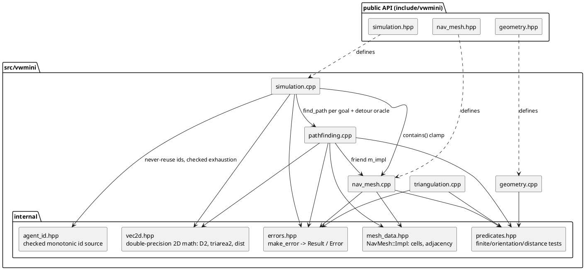

# VWmini Architecture

## Overview

VWmini is implemented as five internal modules behind the fixed public headers
(`geometry.hpp`, `nav_mesh.hpp`, `simulation.hpp`). All code is single-threaded,
allocation-owning (RAII, no raw owning pointers), standard-library-only, and
deterministic for identical finite inputs on one platform. Validation lives in
factory/mutator entry points and is strictly separated from steady-state stepping.
The public headers keep their supplied declarations; internal modules live under
`src/vwmini/internal/` and are not installed.

## Module Diagram

Dependency direction: `predicates` (leaf) ← geometry/triangulation ← mesh ←
pathfinding ← simulation. No cycles. `NavMesh::Impl` is declared in the public
header as an opaque struct and *defined* in `internal/mesh_data.hpp`;
`find_path` accesses it through the `friend` declaration already present in the
supplied header. `Simulation::Impl` is defined inside `simulation.cpp` (only
`Simulation` touches it).

## Components and Responsibilities

| Module | Files | Responsibility |
|---|---|---|
| Geometry | `geometry.cpp`, `internal/predicates.hpp` | `length`, `normalized` — both computed in double precision on the float inputs; `length` saturates at `FLT_MAX` and `normalized` guarantees a unit-length result for every finite non-zero input (MSH-001). Shared scalar predicates: finiteness, orientation (double-precision cross), point–segment distance, segment intersection. Leaf utility, no state. |
| Triangulation | `triangulation.cpp` | `triangulate_simple_polygon`: validate outline (MSH-002), remove collinear vertices, deterministic ear clipping (MSH-003). Pure function. |
| Nav mesh | `nav_mesh.cpp`, `internal/mesh_data.hpp` | `NavMesh::create` validation (MSH-004: finiteness, per-triangle validity, interior overlap, non-manifold edges, T-junctions), epsilon edge matching → adjacency (MSH-005), `contains` (MSH-006), `cell_count`. `Impl` is immutable after construction and held via `shared_ptr<const Impl>` so `NavMesh` stays a copyable value type. |
| Pathfinding | `pathfinding.cpp` | `find_path` (SIM-001..004): endpoint validation, cell location, direct-segment containment test, deterministic Dijkstra over cell adjacency, funnel string pulling, epsilon suppression of near-duplicate interior points. Pure functions over `const NavMesh::Impl&`. |
| Simulation | `simulation.cpp`, `internal/agent_id.hpp` | `Simulation`: agent lifecycle and ids (SIM-005, SIM-013), goal/state transitions (SIM-006..007, SIM-009), substepped movement (SIM-008), snapshot-based local avoidance (SIM-010..012). Owns agents in an id-keyed store; reads the immutable mesh. |

## Ownership and Data Flow

- `NavMesh::create` consumes the caller's `std::vector<Polygon>` by value,
  validates, builds `Impl` (triangles kept in caller order, deduplicated vertex
  table, per-edge adjacency), and returns it wrapped in `shared_ptr<const Impl>`.
  Failure returns an `Error`; no partial mesh escapes (transactional, MSH-007).
- `Simulation` owns its `NavMesh` value (and thus a share of the immutable
  `Impl`) plus `unique_ptr<Impl>` agent storage. Agents are stored in a
  `std::vector<AgentRecord>` with a free list; `AgentId.value` is a non-zero
  monotonically increasing generation counter key, never reused. The checked
  `internal::AgentIdAllocator` makes exhaustion sticky: when the 32-bit id
  space runs out, `add_agent` fails transactionally with `InvalidArgument`
  instead of wrapping onto a live id (SIM-005).
- Goal setting: `set_goal`/`add_agent` validate, then call `find_path` once and
  store the resulting route + waypoint index; `NoPath` results are stored as
  status, not errors (SIM-007).
- `step(dt)`: validate → split into uniform substeps of at most `1/60 s`
  (capped at 4096 substeps per call; longer durations receive fewer, coarser
  substeps) → per
  substep: (1) snapshot all live positions/velocities, (2) for each agent in
  snapshot order compute desired route-following velocity, then a collision-free
  velocity from a deterministic candidate set scored against the snapshot,
  (3) integrate with waypoint/goal clamping and a mesh-containment guard,
  (4) update arrival states. All mutations happen after the snapshot read
  (SIM-010), so planning order does not affect the result.

## Key Decisions and Trade-offs

1. **Containment via closed interior OR edge-distance (MSH-006).** A point is
   contained by a CCW triangle iff it lies in the *closed* triangle (three
   same-sign orientation tests) **or** within Euclidean distance `epsilon` of
   any of its three closed edge segments (`triangle_contains_eps`). This
   disjunction is exactly the contract policy. The WP2 revision replaced an
   earlier epsilon-dilated-half-plane formulation, which overshot by up to
   `epsilon/sin(theta/2)` near sharp corners (accepting points the contract
   excludes). `orient` widens each coordinate to double before subtracting, so
   the interior test is a true double-precision cross product. Trade-off:
   linear scan over all cells instead of a spatial index; justified by NFR-008
   (no caches beyond test responsiveness) and keeps `contains` trivially
   deterministic and allocation-free.
2. **Direct-segment containment by interval coverage (SIM-001).** For segment
   `s + t(g−s)`, each epsilon-dilated triangle contributes a closed interval of
   `t` (half-plane tests are linear in `t`); the segment is contained iff the
   merged intervals cover `[0,1]`. Exact per the contract, no sampling.
3. **Dijkstra + funnel instead of A\*/hierarchical search (SIM-003/004).**
   Cell-graph Dijkstra with edge weight = distance between consecutive portal
   midpoints, tie-broken by cell index, gives a deterministic corridor; the
   classic funnel algorithm shortens it to a contained polyline touching only
   portal vertices. The winner among equal-length alternatives is deliberately
   unspecified by the contract (SIM-004), so plain Dijkstra suffices — no A*
   heuristic machinery (NFR-008).
4. **Sampling-based velocity avoidance, not ORCA (SIM-010..012).** Each agent
   scores a fixed deterministic candidate set (desired velocity plus rotations
   at fixed angles and speed fractions, all constructed never to exceed
   `max_speed`) against the frozen snapshot. Deflections whose substep landing
   would leave the mesh are skipped (the desired velocity executes as route
   walking and is exempt); candidates predicted to overlap a neighbor within a
   ~1 s horizon are ranked infeasible, and when none is feasible the one
   maximizing predicted separation wins. The overlap prediction charges a
   replanning margin `2·(s_i+s_j)·dt` only for neighbors that are *Moving*:
   a moving neighbor's snapshot velocity can deviate by up to
   `2·max_speed·dt` before the next replan, while an immobile one
   (parked/Reached) executes no motion at all and its snapshot is exact. Charging immobile neighbors the
   same margin made corridors barely wider than the radius sum impassable — a
   follower froze permanently behind a Reached leader (regression:
   `FollowerPassesReachedLeaderInTightCorridor`). The radius-sum separation
   floor itself is never relaxed. Zero velocity is always present as a
   conservative fallback. Trade-off: no formal collision-free guarantee (the
   contract only requires normal-crowd behavior for small feasible open-space
   interactions), in exchange for ~100 lines of obvious, testable code with no
   half-plane solver.
   Movement execution independently preserves containment (SIM-012): a straight
   detour step along the chosen velocity is taken only when the public
   `find_path` confirms the whole substep segment is covered by the mesh
   (a two-point direct route with matching endpoints); otherwise the agent
   route-walks the corridor, which stays inside by construction. This closes a
   concave-corner-cutting hole that an endpoint-only containment test left
   open. `find_path` is used as the coverage oracle because the frozen
   `nav_mesh.hpp` befriends only `find_path`, so `simulation.cpp` cannot reach
   the mesh cells directly.
   Whichever branch executes, the chosen landing is clamped back toward the
   start with `std::nextafter` until the *stored float* displacement fits the
   `max_speed·dt` budget (`clamp_step`), keeping SIM-008's cap exact under
   float rounding — a naive `from + dir·budget` can store a value one ULP
   beyond the cap; when no representable step fits, the substep is a no-op.
5. **Ear clipping instead of constrained Delaunay (MSH-002/003).** Deterministic
   O(n²)–O(n³) ear clipping with a collinear-vertex pre-pass satisfies the
   output contract (non-degenerate CCW triangles, area preserved, input vertices
   only). Delaunay quality is not required; simpler code wins.
6. **Triangles stored in caller order.** MSH-008 permits reordering, but
   preserving order makes containment/location results and deterministic
   tie-breaking directly traceable to caller input (which the contract says may
   affect tie-breaks).
7. **Validation helpers return `std::optional<Error>`-style results and never
   throw**; the public boundary translates to `Result<T>` (NFR-005/006). No
   exceptions cross the API; library code performs no console output, no global
   mutable state, and no `new`/`delete` (containers and smart pointers only).

## Error Handling

All public fallible operations validate inputs before any mutation
(Transactional per MSH-007 / SIM-008). Error mapping follows NFR-006 exactly:
non-finite scalars → `InvalidArgument`; invalid finite geometry → `InvalidMesh`;
finite out-of-mesh points → `OutsideMesh`; disconnected in-mesh endpoints →
`NoPath` (an error from `find_path`, but a *status* from `set_goal`/`add_agent`);
unknown ids → `NotFound`. Messages are short, human-readable, and stable enough
for tests to rely on codes only (never on message text).

## Testing Strategy

GTest (system package). A WP0 `smoke` binary verifies the `vwmini::vwmini`
target links, then roughly one binary per module area: `geometry`,
`triangulation`, `nav_mesh`, `pathfinding`, `simulation` (plus a dedicated
`simulation_avoidance` binary for multi-agent interaction), `agent_id`
(white-box: `tests/` receives the `src/` include directory to unit-test
internal components whose failure modes — id-space exhaustion — are
unreachable through the public API in a test lifetime), and `integration`
(triangulate → create → find_path → step). All test targets are gated behind
the `BUILD_TESTING` option (default ON), so library-only builds never require
GTest. Tests are deterministic: fixed
literal geometry, no time/random inputs, exact or epsilon-bounded assertions per
the requirement they cite.
